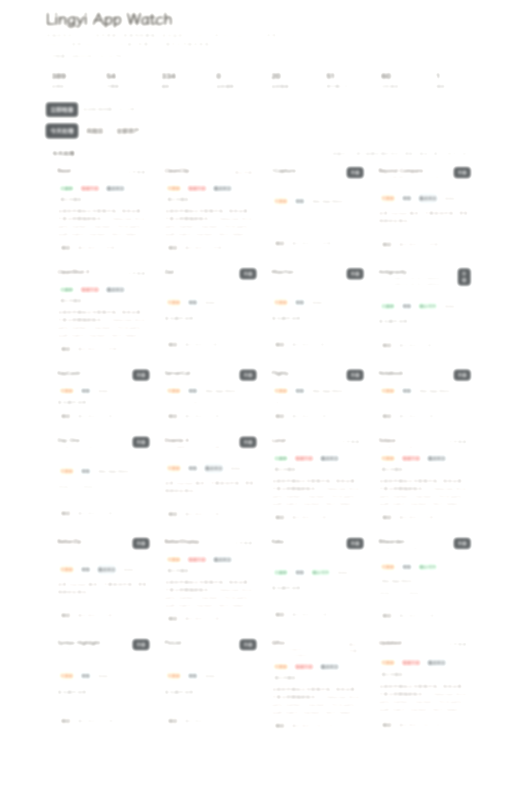

# Lingyi App Watch

本地优先的 macOS 软件更新看板。  
它不只是告诉你“有新版本”，还会把软件来源、升级风险和你的人工标记一起整理出来，帮你先判断，再决定要不要升。

[官网](https://watch.lingyi.tools) · [GitHub Releases](https://github.com/Jascenn/local-software-update-monitor/releases) · [问题反馈](https://github.com/Jascenn/local-software-update-monitor/issues)



## 为什么用它

- 软件来源很杂：brew、Mac App Store、GitHub、官网、历史安装包不会自己汇总到一起。
- 有些软件不能乱升：第三方来源、激活版、兼容性敏感的软件需要单独看待。
- 记忆靠不住：你可以把“不要升级”“待核验”“重点关注”直接写进系统里，后续继续参与排序和筛选。

## 当前支持

- 自动发现：`Homebrew`、`Mac App Store`
- 配置补充：`GitHub Releases`、`Sparkle Appcast`、`JSON endpoint`、`HTML regex`
- 本地能力：第三方来源审计、人工标记、批量操作、CLI 查看

## 你可以用它做什么

- 把本机软件更新整理成一张清单
- 区分“可直接升级”“需要手动处理”“暂缓升级”
- 单独标出第三方来源和高风险项目
- 在网页里筛选、排序、批量标记
- 在 CLI 里按状态、策略、标记继续筛选

## Quick Start

```bash
git clone https://github.com/Jascenn/local-software-update-monitor.git
cd local-software-update-monitor
npm install
npm run dev
```

首次启动会自动创建 `monitor.config.json`，并优先把本机能直接提取更新源的 App 自动接进来。

打开：

```text
http://127.0.0.1:4123
```

## 常用命令

```bash
npm run dev
npm run init
npm run check
npm run build
npm run audit:sources:save
npm run audit:artifacts
npm run cli -- --view today
```

## 数据和运行方式

- 这个项目的监控内核依赖本机 `brew`、`mas`、`/Applications` 和本地软件元数据
- 公开站点只负责产品介绍和下载入口，不直接读取你的真实软件列表
- 真正的扫描、标记、筛选和升级操作都优先在你自己的 Mac 上完成

## 仓库结构

- [src](./src): 本地监控服务、CLI、API 和网页看板
- [site](./site): 对外官网与说明页
- [reports](./reports): 发布、审计和方案文档
- [monitor.config.example.json](./monitor.config.example.json): 高级手工配置示例

## 进一步说明

- 官网：<https://watch.lingyi.tools>
- 站点目录说明：[site/README.md](./site/README.md)
- 版本记录：[CHANGELOG.md](./CHANGELOG.md)

## 作者

由 [Jascenn](https://github.com/Jascenn) 发起并维护。  
更多信息见 [lingyi.tools](https://lingyi.tools) / [lingyi.bio](https://lingyi.bio)。
