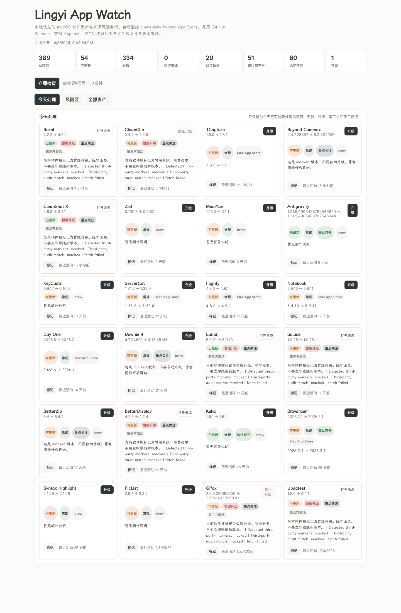

# Lingyi App Watch

一个面向 macOS 的本地优先更新看板，用来统一查看机器上软件的当前版本、可更新版本，以及第三方来源带来的升级风险。



## 发布定位

- 对外产品名：`Lingyi App Watch`
- 当前仓库名：`local-software-update-monitor`
- 当前版本：`0.3.0`
- 推荐发布方式：本地应用继续在本机运行；`lingyi.tools` / `lingyi.bio` 用来承载官网、下载页、截图和说明页

这个项目的监控内核依赖本机 `brew`、`mas`、`/Applications` 和本地软件元数据，所以不适合直接部署到 Cloudflare Pages / Workers 里运行。Cloudflare 更适合承接官网、下载页、发布说明、截图页，以及受保护的远程入口。

支持两类监控方式：

- 自动发现并检测：
  - Homebrew formula / cask
  - Mac App Store (`mas`)
- 配置式检测：
  - GitHub Releases
  - 官方 Sparkle Appcast
  - 官方 / 第三方 JSON 接口
  - 官方 / 第三方 HTML 页面正则抓取

## 为什么这样设计

不同渠道的软件没有统一元数据来源：

- `brew` 和 `Mac App Store` 可以直接通过本机命令拿到安装状态和更新状态。
- GitHub、官网、第三方下载站虽然能查到“最新版本”，但通常需要你告诉项目去哪里查。
- 本地 `.app` 可以自动扫描，但“去哪儿找最新版本”必须靠配置补齐。

所以这个项目分成两层：

1. 自动监控 `brew` / `mas`
2. 用 `monitor.config.json` 补充 GitHub / 官网 / 第三方来源

## Quick Start

1. 安装依赖

```bash
npm install
```

2. 复制配置

```bash
cp monitor.config.example.json monitor.config.json
```

3. 启动开发模式

```bash
npm run dev
```

4. 打开页面

```text
http://127.0.0.1:4123
```

## 这次发布包含什么

- 更像数据库的简洁看板视图，按“今天处理 / 风险区 / 全部资产”组织
- 可点击的汇总卡片、主表排序、筛选和风险优先排序
- 主表和第三方列表支持 `Shift` 连选、全选和批量标记
- 第三方来源审计、人工记忆和升级策略叠加
- 只能一键升级、需要手动处理、不能一键升级的区分
- 发布截图、变更记录和上线方案文档

## 可用命令

- `npm run dev`: 直接运行 TypeScript
- `npm run audit:sources`: 扫描本机 `.app`，输出疑似第三方来源标记
- `npm run audit:sources:save`: 扫描并保存到 `data/source-audit.json`
- `npm run audit:artifacts`: 根据审计结果生成策略文件和 Markdown 报告
- `npm run generate:candidates`: 生成可直接接入监控的第三方追踪候选项
- `npm run cli -- [status|policy|candidates] ...`: 在命令行里筛选、排序和查看结果
- `npm run check`: 类型检查
- `npm run build`: 编译到 `dist/`
- `npm run start`: 运行编译产物
- `npm run check-once`: 执行一次检测并打印摘要

## 配置说明

配置文件默认是项目根目录下的 `monitor.config.json`。

### 顶层字段

- `port`: Web 服务端口，默认 `4123`
- `pollIntervalMs`: 轮询周期，默认 `1800000`（30 分钟）
- `appLocations`: 本地 `.app` 扫描目录
- `trackedApps`: 需要额外监控的软件列表

### installed 类型

#### 1. 自动从本地 app bundle 读取当前版本

```json
{
	"kind": "appBundle",
	"bundleId": "com.raycast.macos"
}
```

也可以写：

```json
{
	"kind": "appBundle",
	"path": "/Applications/Raycast.app"
}
```

#### 2. 手工指定当前版本

```json
{
	"kind": "manual",
	"currentVersion": "1.0.0"
}
```

### source 类型

#### GitHub Release

```json
{
	"kind": "githubRelease",
	"repo": "owner/repo",
	"versionPrefix": "v"
}
```

#### Sparkle Appcast

```json
{
	"kind": "sparkleAppcast",
	"url": "https://example.com/appcast.xml"
}
```

#### JSON 接口

```json
{
	"kind": "jsonEndpoint",
	"url": "https://example.com/latest.json",
	"versionPath": "data.version"
}
```

#### HTML 页面正则

```json
{
	"kind": "htmlRegex",
	"url": "https://example.com/downloads",
	"pattern": "Latest Version:\\s*([0-9.]+)",
	"matchGroup": 1,
	"flags": "i"
}
```

## API

- `GET /api/status`: 当前检测结果
- `POST /api/check`: 立即执行一次检测
- `GET /api/inventory`: 本地发现的软件清单
- `GET /api/history`: 最近的检测历史
- `GET /api/source-audit`: 第三方来源审计结果
- `GET /api/source-policy`: 第三方软件的默认处理策略
- `GET /api/tracked-candidates`: 自动提取出的第三方追踪候选项
- `GET /api/annotations`: 当前本地记忆标记
- `POST /api/annotations`: 新增、更新或清除本地记忆标记

## 人工标记 / 本地记忆

除了自动检测出的第三方来源和升级风险，你还可以直接在网页上对软件做人工标记，并把结果写入本地记忆文件。

- 数据文件：`data/annotations.json`
- 使用方式：在主监控表或“第三方来源 / 暂缓升级”卡片上点击“标记”
- 标记类型：
  - `watch`: 重点关注
  - `avoid`: 不要升级
  - `safe`: 确认可升
  - `todo`: 待核验
  - `ignore`: 忽略

这些人工标记不会覆盖自动检测结果，但会作为额外的安全层叠加进去：

- 页面支持按人工标记筛选
- 页面支持多选后批量打标
- 默认“风险优先”排序会把 `avoid` / `todo` 这类人工高风险标记压到更前
- CLI 输出也会带上 `MARK` 列，并支持 `--mark` 过滤

## 网页内操作

主监控表现在支持按来源做不同操作：

- `brew` / `Mac App Store`：可以直接在网页内点“升级”
- GitHub / 官网 / Appcast / JSON / HTML 来源：提供“打开来源”
- `thirdPartyActivated`、`hold`、以及你人工标记为 `avoid` / `todo` 的项目：禁止一键升级
- `cautious` 项目：需要你先人工标记为 `safe`，才会开放一键升级

### CLI 示例

```bash
npm run cli -- --updates-only --policy hold
npm run cli -- --mark avoid
npm run cli -- status --search CleanShot --third-party-only
npm run cli -- policy --marker macked --limit 10
npm run cli -- candidates --confidence high
```

## 第三方来源策略

如果一个 App 不是从官方站点、Mac App Store、Homebrew 或项目官方 GitHub 获取，而是来自第三方改包、激活器或第三方资源站，建议统一按“第三方”处理。

当前项目的默认做法是：

- 审计脚本发现 `macked`、`TNT`、`MacWK`、`appstorrent`、`QiuChenly` 等明显标记时，会写入 `data/source-audit.json`
- `npm run audit:artifacts` 会进一步生成：
  - `data/third-party-policy.json`
  - `reports/third-party-audit.md`
- `npm run generate:candidates` 会生成：
  - `data/tracked-app-candidates.json`
  - `reports/tracked-app-candidates.md`
- 监控服务读取该文件后，会把命中的已配置软件默认视为：
  - `activationSource: "thirdPartyActivated"`
  - `upgradePolicy: "hold"`

也就是说，即使检测到新版本，也只做提示，不建议直接升级。

如果第三方软件的 App 包内能直接提取 `SUFeedURL`，系统会自动把它生成为候选追踪项，并优先用 `appBundle + sparkleAppcast` 进入主监控表。这样比单纯依赖 `brew cask` 版本更接近真实已安装版本。

## 运行注意事项

- 依赖本机存在 `brew`、`mas`、`plutil`
- `mas` 需要先登录 App Store 账号
- `brew` 的“最新版本”依赖本机 Homebrew 元数据是否已更新
- 对官网 / 第三方来源，建议优先使用稳定的 JSON / Appcast；HTML 正则只是兜底
